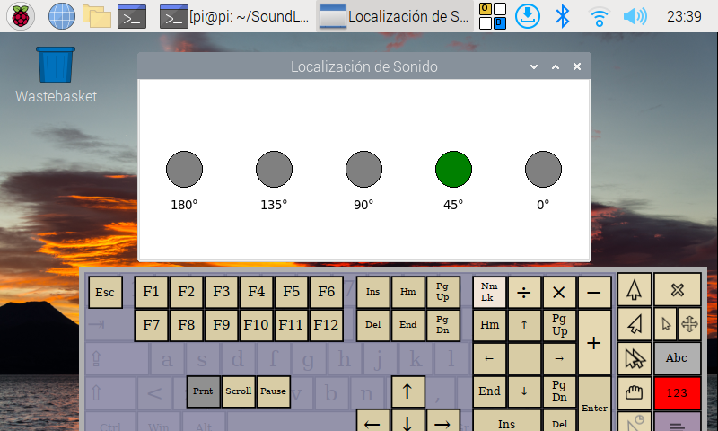

# Agente Simple de Localizacion de Sonido 

Este agente se basa en un modelo de redes neuronales, el cual localiza sonidos en 5 orientaciones. 
La interfaz indica cual es la orientacion mas probable desde la cual esta ubicado el sonido y el modelo que actualmente esta implementado localiza voces. 



## Instrucciones de uso

El software fue desarrollado y testeado empleando como Hardware:
+ Raspberry pi 3b
+ ReSpeaker 2 Mic Hat
+ Pantalla 7"

Para la ejecucion, instalar dependencias:
```bash
pip install -r requirements.txt
```

Ejecutar script de aplicacion:
```bash
python3 main.py
```

